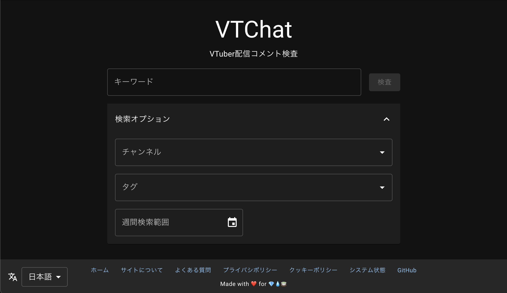

# VTChat

VTuber Chat Search

A search engine for VTuber livestream chat, find interesting topics from past livestreams. Useful for making clips / shorts.

Live demo: [https://akiroz.github.io/vtchat](https://akiroz.github.io/vtchat)




## Future work

Support video audio transcription generation & indexing via VAD/TTS pipeline.

## Development

Project root contains the backend codebase while the frontend lives inside `frontend/`.

### Backend developemnt:

```
$ docker compose up --build
```

The backend process denpends on several environment variables which can be set in a `.env` file:
- `NODE_ENV` start in development mode if not set to `production`
    - scheduled tasks are disabled
    - server is plain HTTP, does not care about reverse proxy
    - server is served on port 3000 (can be overwritten by env `PORT`)
- `VTCHAT_MGNT_KEY` management key (dev mode: `admin`), authentication for management APIs
- `VTCHAT_MONIT_KEY` monitoring key (dev mode: `monit`), authentication for external monitoring APIs
- `VTCHAT_YT_KEY` YouTube API key (always required)
- `VTCHAT_API_CERT` HTTPS X.509 cert path
- `VTCHAT_API_KEY` HTTPS X.509 key path

Authenticated APIs uses basic auth with keys as username, auth header should be formatted as follows:
```
Basic ${base64(key + ":")}
```

Build production image:
```
docker build --tag ghcr.io/akiroz/vtchat .  ## --platform=linux/amd64
```

### Frontend developemnt:
```
$ cd frontend
$ yarn start            ## Main Web UI
$ yarn start-console    ## Management Console
```

There are 2 seperate frontend apps sharing the same build toolchain configured in `vite.config.mjs`, src root dir are:
- `frontend/search` Main public-facing website (served by external hosting)
- `frontend/console` Management console (served directly by backend)

Management APIs do not have CORS support, during development the dev server will proxy requests to the backend which
needs to be running on localhost at the same time.

## Data Ingestion

Channels of interest are stored in the database `channel` table.

VTChat periodically polls the most outdated channel for new livestreams, newly discovered stream archives are put on a job queue for further processing.

Currently livestreams less than 1 day old are ignored as a grace period.

A worker sequencially fetches video livechat data to be indexed in the database. 

## Management Console

A basic management console is avaliable on the backend server `/mgnt` for administrative tasks such as:

- Adding channels of interest
- Setting tags on channels
- Monitoring the ingestion pipeline for failed jobs
- Manually adding videos to be indexed


## Special Thanks

- Inspired by [にじさんじコメント検索](https://comment2434.com/)
- [pgroonga](https://pgroonga.github.io/) / [Groonga Project](https://groonga.org/)
- [Masterchat](https://github.com/stu43005/masterchat) ([@uetchy](https://github.com/uetchy), [@stu43005](https://github.com/stu43005))
- All the kind folks at [Holodex](holodex.net) who helped along the way


Made with ❤️ for 💎💧🍵
